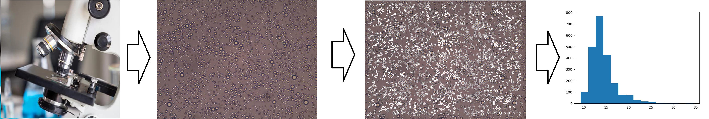

# microscopy-bubbles-recognition
Microscopy bubbles segmentation and size measuring system for scientific purposes by Korolev I.A.

This project is designed to automatically label air bubbles on microscopic images.
Any cuda videocard is required. Minimal requerement is GTX650 for segmentation, and 1650GTX 4G VRAm for models training.

Just put imgs in /microscopy image labeler/imgs/ and run 

<pre>labeler****.py</pre> to process the image and get img.pigy files.
Then run the editor <pre>edit.py    ******.pigy</pre> to get the result and fix some segmentation issues if required.

The supplementary material can be found here:

https://fptt.ru/en/issues/22025/21971/
